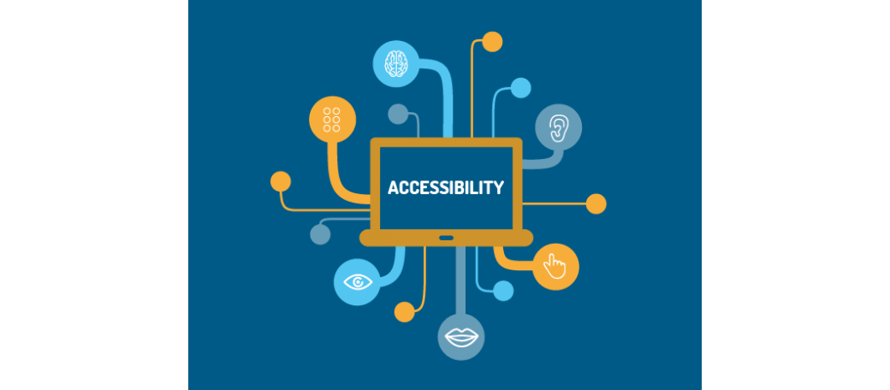

# Web accessibility is fascinating.
 
> Web developers often forget or prevent the accessibility of websites. But with some insight it does not cost a lot of extra work and even offers surprising advantages.

Accessibility. Threshold-free. As an experienced front-end developer, you've heard about it a few times. But what exactly is it? Something about blind people who can not use your website, right? You feel shamelessly guilty that the subject is of little interest to you. So to get rid of those feelings, you go to your management: if you can make it their problem, you do not have to worry, do you? But what does management say? "You are right, we have to do something about it. Go ahead and think about exactly what needs to be done. "

This is exactly what happened to me recently during a freelance job. I decided to take this opportunity to get a deeper understanding of the subject. When I started, I saw web accessibility as a difficult, vague subject. I associated it with outdated government regulations and ugly blocked websites. But what appears? Accessibility is a fascinating subject!

I see many parallels between accessibility and responsive design. With a responsive design, you try to make your website suitable for as many devices as possible. Accessibility does exactly the same. The difference is that you concentrate not only on the screen resolutions, but also on the input and output possibilities of each device. Is there a view? Or is your website read or printed in Braille? Is there a mouse or only a keyboard? Or should everything be operated via voice commands?

## Real world examples
 
Accessible means that everyone can use your website. And with which target groups you have to take into account is an interesting subject in itself. For example, older users who suffer from memory problems, people with dyslexia or people who can not use a mouse because of RSI. Take a look at the [W3C's Stories or Web Users](https://www.w3.org/WAI/intro/people-use-web/stories) story for stories about how people with different disabilities use the internet.

I can perfectly understand that you wonder how useful it is to put a lot of time and effort into supporting what is likely a very small group of your website traffic. But these are the people who are very interested in well functioning websites. So if your website is the only one in your branch with good accessibility, you are suddenly the go-to site for a whole subgroup of your potential target group.

Imagine that large parts of the internet would be unusable for you. That limits you enormously to your possibilities in this modern world. No online stores, no streaming media. It may seem like you are on the internet with an old Netscape browser. Most sites will work, but so badly that it is a very frustrating experience. How long would you accept this?

Fortunately, it is not difficult to offer all your visitors a functioning website. If you stick to HTML standards and best practices, your website is often accessible out-of-the-box. But to add that extra piece of convenience, you have to work creatively. And that is just a nice challenge.

## Alt Text
 
Take the "alt-text" for an image. You know, the text that the browser shows when your image can not be loaded. Some people with visual impairments can not see the picture at all, but they can have their computer read the alt text. So if there is information in the image that users should follow the page correctly, they will depend on your caption. Thinking what fits into text is still not as simple as you might think.

*Do you know who also reads your alt-text? Google - Because they obviously work with bots who do not know what an image looks like. (Not in the last place - they are working on it.) So, if you can write good alt texts, your SEO score will increase again.*

That is a pattern that we see more often: by improving the accessibility of the website you have extra advantages that are fun for all your visitors. This point is clearly demonstrated in a series of videos that can be found on YouTube under the title "Web Accessibility Perspectives". Do yourself a favor, watch them! The videos are well made and very interesting. The motto of these videos is "Accessibility: essential for some, useful for everyone." I fully agree with this statement.