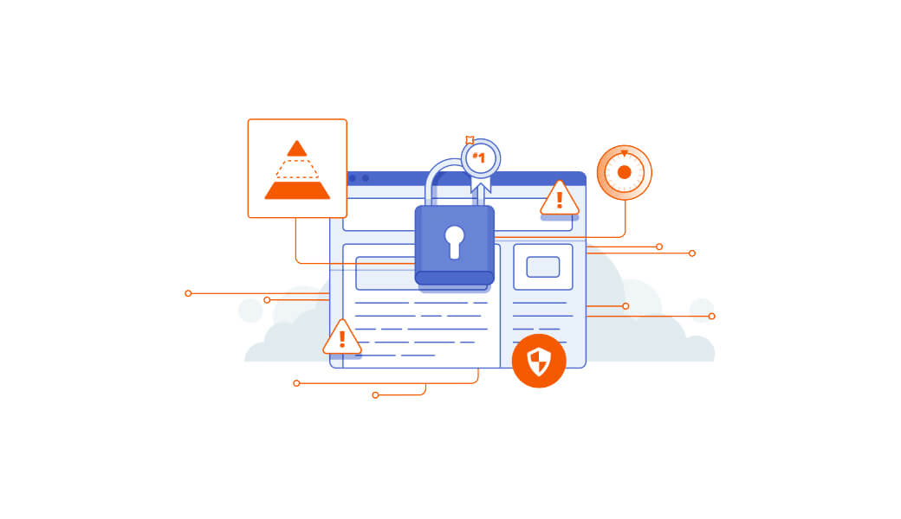
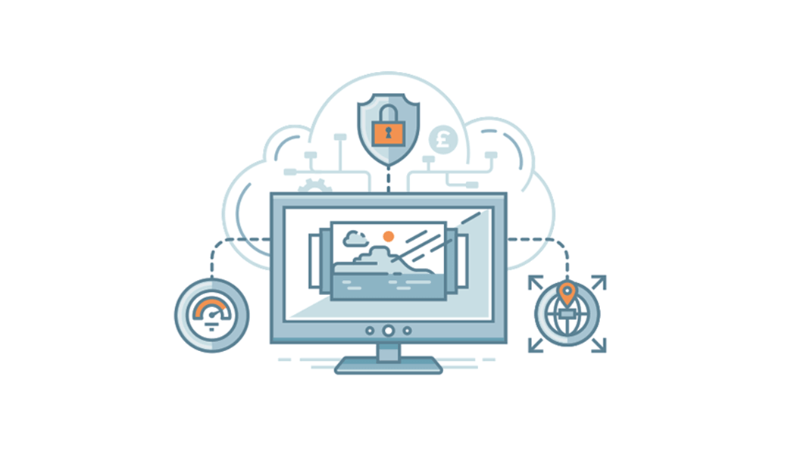

# What can you do to improve WordPress security?
 
You are increasingly reading about websites that are being hacked. Especially WordPress websites seem popular with hackers. However, this is not very strange, because many websites use WordPress. This makes it a popular target for hackers.

Fortunately, there are several things you can do about this. You can secure your database and improve the security of your websites. This makes it as difficult as possible for the hacker.

If you are well prepared, you can quickly restore a hacked website. However, you must have a plan ready. If you do not have a plan, a hack can mean the end of your website. You can fortunately protect your website in many ways. This makes it as difficult as possible for the hacker. In this article we will explain you step by step how you can secure your own WordPress website. If you do not understand the safety of websites, then this article is still suitable for you. We explain everything very easily. Of course we also offer a security package, more information can be found [on our website](https://www.kreynation.com/services).

## The security phases
 
Strong website security consists of several phases. These phases are prevented, detected and reacted. If you want to secure a website properly, you have to use all 3 phases.

## 1. Prevention
 
The first phase of website security is to try to prevent a hack. You do this by securing a website in different ways. This reduces the chance by making potential hackers as difficult as possible.

## 2. Detection
 
There is always a (small) chance that your website will be hacked anyway. That is why the second phase is to detect a hack. If your site is hacked, it is important that you find out as quickly as possible. You can then act quickly and limit the damage.

## 3. Reaction
 
The third and final phase is about how you respond to a hack. Do you have a plan ready or should you start thinking about what to do?

If you are well prepared, you can quickly restore a hacked website. However, you must have a plan ready. If you do not have a plan, a hack can mean the end of your website!

 {.img-fluid .mb-5}

# Let's start!

## Secure your website in 7 steps
 
You now know what the phases of website security are, but you still do not know how to apply it exactly. That is why we are now showing you how to secure your website against hackers in the following 7 steps.

## 1. Update regularly
 
It is important that you regularly update WordPress. You also need to regularly update the themes and plug-ins that you have installed. In older versions you can sometimes find leaks that hackers can use to hack your website. If you regularly update, hackers can not use such a leak to access your website.

## 2. Do not choose a default username
 
One way hackers try to hack websites is through brute force attacks. In doing so, they try to guess the username and password to log in to the dashboard.

On many WordPress websites, the username is the default 'admin' and hackers know that. They only have to guess the password. So do not make hackers too easy and choose a username that is not easy to guess!

Do you use a username that is easy to crack? Then it is advisable to change the username.

## 3. Choose a strong password
 
Besides a hard to guess username, you also need a password that is difficult to crack. If hackers guess your username correctly, they should also guess the password. If you have a difficult password, this is virtually impossible.

Choose or create a password consisting of uppercase, lowercase and special characters. If you want to create a good password, you can easily do this with a password generator. It is also important to store your password securely somewhere. For password storage we recommend [LastPass](https://lastpass.com/f?26081922).

## 4. Limit the number of log-in attempts
 
With a strong username and password you are already well on your way. There is, however, something else you can do to ensure that brute force attacks have no chance at all.

Limit the number of log-in attempts!

Hackers usually use a bot network consisting of many computers and they can enter different usernames and passwords very quickly. If there is no limit on the number of login attempts, the computer will continue until the correct username and password are found.

To avoid this, make sure that everyone can only try to log in a few times. If logging in with someone fails, this person must be automatically blocked. If you want to set this up, you can use the plug-in [Wordfence](https://wordpress.org/plugins/wordfence/).

## 5. Scan your website regularly
 
The second phase of website security is to detect a hack. To do that, you must install a plug-in that will scan your website regularly.

Again, Wordfence is the plug-in that we recommend for use on your site. Wordfence can be set to scan your entire website every day. You also have the option to use the premium version of Wordfence and you can even scan your website several times a day.

If Wordfence encounters something during a scan that is not in order, the plug-in informs you immediately. You will receive an e-mail and you can solve the problem yourself.

## 6. Prevent a DDoS attack
 
You have probably heard something about DDoS attacks. In a DDoS attack, an attempt is made to get a website off the air by sending as much traffic as possible to it so that the server can no longer handle it.

Although it is difficult to completely prevent a DDoS attack, there are a few things you can do about it.

Have you already installed Wordfence? If you have not already done so, it is best to do this first. In Wordfence there are several functions that can help you avoid a DDoS attack.

First, Wordfence has a firewall that you can setup yourself. If visitors visit your website too often, something that is a typical pattern for a DDoS attack, you can have these visitors automatically blocked. Normal visitors can easily continue visiting the website and are not blocked.

You can also use the built-in 'Falcon Engine'. This is a cache plug-in that makes your website faster and smaller. This makes it harder for hackers to get your site off the air with a DDoS attack.

## 7. Back up regularly
 
If you have applied all the information in this article, your website is properly secured. There is always a small chance that your website will be hacked, because no security is watertight.

That is why you have to back up your complete WordPress website. From both the files and the database! If your site is hacked anyway, you can delete the compromised version and restore the old files.

A hacked website can be quickly restored and put online again (with improved security)!

You can make backups manually, but the easiest way is to use a plug-in for this. There are several plug-ins that allow you to make backups. We use the plug-in [BackUpWordPress](https://wordpress.org/plugins/backupwordpress/).

If your website is hacked, do not forget to check your site for leaks. After all, someone has managed to hack your website and if you do not discover the cause and solve it, someone can hack your website again!

 {.img-fluid .mb-5}

## Useful plug-ins for WordPress security
 
We encourage everyone to use [iThemes Security](https://ithemes.com/security/) for the security of WordPress websites. We believe this is the best plug-in for security.

However, if you are not satisfied with iThemes Security, you can look at Wordfence, [All In One WP Security & Firewall](https://wordpress.org/plugins/all-in-one-wp-security-and-firewall/) or [BulletProof Security](https://wordpress.org/plugins/bulletproof-security/). These plug-ins are good alternatives for iThemes Security and also work well.

## Finally
 
Have you read the entire article and applied the information? Then your website is now a lot safer and it is much more difficult for hackers to hack your site. If hackers can still hack your website, you have at least a backup. With the help of the backup you can quickly restore your website.