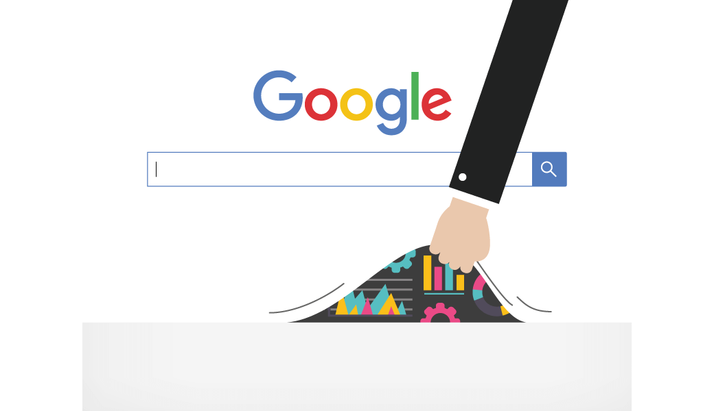

 
 
We have of course optimized our websites for search terms with a lot of search volume. Generally these are generic search terms or combinations of two keywords. We try to optimize our website as much as possible.

In recent years, the use of speech has increased when searching in search engines. In 2016 we have already seen this trend, Google then indicated that one in five people use voting search. ComScore expects that this share will be even higher in 2020, namely 50 percent. In addition to the smartphones and tablets, the smart devices are nowadays located in our homes, such as the Amazon Echo and Google Home, which are increasingly being used with voice commands.

With speech, the searches are not only becoming longer, but also different. Previously, users entered keywords in a search via the keyboard. When users use voice search, they often consist of a question or a sentence. The number of words in a voice search is therefore longer on average than traditional search keywords.

Because we search different with our voice than with the keyboard, it is important to use natural keywords and phrases. When we type a keyword, we often keep it as short as possible. For example, we type in: "hotel New York". If we let the smartphone look something up, we say: "I am looking for a hotel in New York". So whole sentences are made instead of just a single keyword.

This also requires a different approach for SEO. Where you have previously optimized on keywords, you should (still) optimize for _longtail_ keyword combinations. The optimization should focus more on questions and problems arising from spoken language. Complete questions with the answers. Google also responds to this with the _featured snippets_, which I will discuss later in this article. So check carefully which questions and problems the searchers have and adjust your content accordingly.

## Visual search
 
Visual search develops better and faster. Previously, Google could only understand images by looking at the textual information that was added by, for example, the webmaster. For example, consider the filename, alt tag, and the _title attribute_.

With the internet becoming more and more visually oriented, it is becoming increasingly important for search engines such as Google and Bing and social media networks such as Pinterest and Instagram to 'read' and understand visual content. Pinterest introduced at the beginning of this year the [Pinterest Lens](https://blog.pinterest.com/en/search-outside-box-new-pinterest-visual-discovery-tools) and AliExpress also uses visual search in their app. These technology companies therefore invest a lot in creating and improving their visual search engines.

    <iframe class="resp-iframe" src="https://www.youtube.com/embed/GtDhZb1nNF0" gesture="media"  allow="encrypted-media" allowfullscreen></iframe>

Visual search recognizes images through advanced artificial intelligence. A common application is _reverse image search_. You drag an image or photo to a search window, after which it is matched with all the images in the database. The best matching images are then displayed. The difference with simple search in Google images is that you do not enter a search term, but drag an image to the search window.

You should also take this into account with your SEO strategy in the coming year. Visual search becomes huge, huge! Nobody knows exactly how the technology and user experience for visual searches will develop, but that things are going fast.

## Linkbuilding remains of great importance
 
Linkbuilding was important from the very beginning of SEO. This will not be any different in 2018. But what will be a big difference is that it is mainly the high-quality backlinks that have a positive influence.

SEO specialists always talk about natural backlink profiles. A backlink profile should look as natural as possible and therefore contain both relevant and irrelevant backlinks. In practice, not all backlinks should be relevant to the topic of your website. In a natural situation, where no work is done in the field of SEO, a backlink profile is created in a natural way, where the types of backlinks are diverse; think of backlinks of news websites, press releases, company guides, links of sponsor websites, charities and initiatives, profiles on websites or links of corporate networks. These do not always directly relate to the subject of your website. The type of backlinks can therefore vary; think of text links, image links and brand links.

Link building is something that you have to pay a lot of attention to. Do this well and in a natural way, this gives a big boost. Do not just focus on new backlinks, but also look at your existing backlinks. Several tools are available for this, such as [Majestic](https://majestic.com/) and [Ahrefs](https://ahrefs.com/).

In addition, the focus in 2018 must be on setting up sustainable relationships within and outside your network. For example, if you offer a broker training, you can approach graduate brokers with the request to state on their websites that they have completed their broker training at your educational institution. You can also approach other less relevant parties (with whom you collaborate) for an online collaboration. Think of a caterer, cleaning company or printing company. In this way you arrive at a natural and balanced backlink profile.

 {.img-fluid .mb-5}

## The ease of use of the website is and remains essential
 
Search engines like Google find it important that the websites shown in the results are user-friendly. After all, a website must be shown that not only offers the requested information, but that is also easy to navigate and use. To determine user-friendliness, there are a number of factors that Google takes into account.

* **The speed of the website** Make sure there are no long loading times. This can be prevented by compressing or avoiding large images and optimizing content delivery. The server (and therefore the hosting) is also important for the speed of the website. You can generate a report with information by using [Google PageSpeed](https://developers.google.com/speed/)
* **Valuable content.** The information on the website must be interesting and relevant to visitors. There are several statistics available in Google Analytics that you can use to determine whether content is valuable or not. Consider, for example, the time on the pages, bouncerates, and so on. Therefore, entice visitors to surf to other pages. You can achieve this by including internal links in the articles.
* **Direct traffic -** Direct traffic can also be measured in Google Analytics. This is traffic that does not come via a search engine on your website. If there are many people who surf directly to your website, this is also a positive signal. Because of the data in Analytics, Google sees that your website is the starting point for certain information. This is also a reason to increase your website with certain search terms.

In 2018, the usability of your website or webshop must be better than ever. The user experience on all devices must be error-free. Google is a master in interpreting visitor behavior on a website and this will be even more important when it comes to ranking search results. Dive into Google Analytics and identify bottlenecks by seeing where visitors get stuck or drop out. For example, view the behavior on the landing pages. If this is too difficult, you can also use utility tools such as [Crazy Egg](https://www.clicktale.com/) or [Lucky Orange](http://www.luckyorange.com/).

Not only at the statistical level, usability can be improved, also at the content level. The better pages on your website are tailored to the search, the better this is for visitors and the position in Google. There is a strong connection between UX and SEO.

## Mobile traffic is even more important
 
Due to the growth of the use of smartphones and tablets, Google requires that the websites be user-friendly when viewed on mobile devices.

A recent survey by [BightEdge](https://www.brightedge.com/news/press-releases/gap-between-mobile-and-traditional-desktop-search-widens) shows that currently 79 percent of all keywords and 47 percent of the keywords in the top 20 are different on a desktop than on a mobile device. And 57 percent of all internet traffic comes from mobile devices.

Many people find their way and find stores and businesses in the area in this way. Because a large part of the mobile search is local, local SEO is a _must_. The challenge in 2018 will be to coordinate the search and the answers at local level.

## AI and machine learning
 
The fact that Google has a foresight is evident from machine learning and the artificial intelligence that are applied. Machine Learning means that devices have self-learning ability. This has a positive influence on the search engine, which thanks to this development can better determine the position of the search results.

Google has long been working on its own AI system called _RankBrain_. This self-learning system ensures that Google displays relevant pages based on the user, without these words appearing exactly on the pages. Unlike the other SEO trends for 2018, this is one of the few trends that you can not specifically address because it is a self-learning algorithm and not a function or component that you can optimize, such as AMP or website speed.

## Conclusion
 
The SEO trends that started in 2017 seem to become more and more the basis. The SEO trends for 2018 may therefore not be entirely new, but no less important. The trends that have now been deployed will have a major influence on the way of searching on the internet. This logically also offers a different approach to website and webshop optimization.

Do you feel invisible on Google? [Contact us today](https://www.scopeweb.nyc/contact) for more information about the services we offer. Our team of experts can take you out of the shadows and help you reach your target audience.