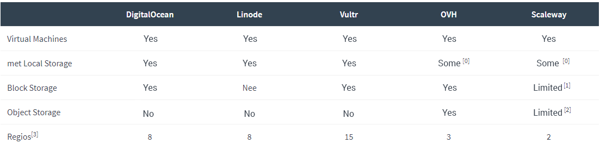

<br>
<br>
Apart from the major players in the cloud hosting industry such as AWS, Google Cloud and Azure, there are several important players who have paved the way by providing a simple infrastructure that makes it easy and affordable to get a new virtual machine up and running in seconds. These include DigitalOcean, Linode, <a href="https://www.vultr.com/?ref=7201550" target="_blank" rel="noreferrer">Vultr</a>, OVH's Public Cloud and Scaleway, a subsidiary of Online.net.

Unlike the big three, those providers do not offer many different infrastructure products. They started with a basic set of functions, mainly compute instances (virtual machines), but some now also offer Block Storage to expand the instance store and Object Storage to easily store a lot of data. We have examined them all to see which provider offers the most and how the performances compare.

In recent months there have been many changes in this space. Linode announced their $5 plan and high-memory plan, as well as Vultr, which announced a $2.50 plan and generally improved the specifications of their products. You now get more value for money on these two platforms. OVH and Scaleway are known for their low prices anyway, you will see below why! DigitalOcean stuck to their initial price until recently, but finally lowered prices, more information on the <a href ="https://blog.digitalocean.com/new-droplet-plans/" target ="_blank" rel ="noreferrer" >DigitalOcean blog</a>.

The cloud is becoming more and more affordable!

Let's start by comparing the products offered by those providers.

 {.img-fluid .mb-5}

<sub><sup>[0] The OVH SSD VPS product line is local storage, whereas the regular public cloud is not. Scaleways VPS series is local storage, while Bare Metal has a network storage.<br>
[1] Block Storage on Scaleway is only offered in 150 GB chunks and only 10 blocks per copy.<br>
[2] While Scaleway officially offers Object Storage, they have not been available for more than a year.<br>
[3] Multiple data centers in the same region are not counted.</sup></sub>

Now that we know which company delivers which products, we will look at the prices of virtual machines. Because this is the basis for most projects and the most important aspect. Because these providers offer a cheap access plan but become non-linearly more expensive, we will compare the 2GB RAM offer from all those companies.

 {.img-fluid .mb-5}

What we see here is the data on the price page. But do not compare it, because the CPU models range from 'cheap' Atom cores to ordinary, Cloud-like E5 copies. Scaleway also has a very strange storage system that is not local, unlike all other companies. It is a solution for network storage that can sometimes become very slow and very unpredictable. But we will see all these details in the benchmarks.

## Which CPU model is used at Vultr, OVH and co?
<br>
All companies show the (virtual) core count in their price overview, but which CPU models are actually used? This is much more important than the actual number of threads you have access to. We have tested at least two locations of each provider to have a broader range of information.

### DigitalOcean CPU model
<br>

 {.img-fluid .mb-5}

<sub><sup>[0] Disclaimer: It is not visible which exact model Vultr and OVH use. OVH states on their website that they use an E5v3 with 2.4 GHz corresponding to the QEMU version and therefore can only be an E5-2620 v3 or E5-2630 v3.</sub></sup>

As we can see, Scaleway offers by far the worst CPU of all participants, at least on paper. DigitalOcean uses an E5 L to save some of those very high energy costs. This CPU should provide more than enough for most tasks. Linode offers the best CPU model, while Vultr and OVH offer very good CPU models that are better than the DigitalOcean, but not as good as the CPU used by Linode. Keep in mind that DigitalOcean, Linode and Scaleway are very transparent about their CPU, which is a good thing! Vultr, on the other hand, tries very hard to hide all the hardware they use. Whether they use a RAID setup is unclear, but that is a subject in itself.

### CPU Benchmark
<br>
Because relying on statistics is probably the worst thing you could do, we show a standard sysbench benchmark of all those CPUs. Because regular benchmarks are sometimes not comparable with real-world usage, we also tested how well those CPUs perform in video transcoding with FFMPEG. In this way we have two different statistics to compare.

The host systems of those providers may otherwise be "busy", meaning that your newly created computer may have many "neighbors" on the host system, while it may also be an almost empty host system. If you have "noisy neighbors", the performance will be significantly reduced, so we ran the benchmark at two different locations to get as many data points as possible.

Most providers offer only one thread with their 2 GB RAM plan, so we ran the sysbench with 1 thread and for providers with two threads we also executed the command for 2 threads.

```
sysbench --test=cpu --cpu-max-prime=20000 --num-threads=1 run
```
```
sysbench --test=cpu --cpu-max-prime=20000 --num-threads=2 run
```
<br>
 {.img-fluid .mb-5}

Lower is of course better, this means that Vultr wins the single thread benchmark. To our surprise, the two Atom cores have defeated two E5 L-CPUs, but only in Location 1! Good thing we ran the benchmark at two different locations 😉. The CPU performance of OVH is actually quite amazing, if you think about it that this machine only costs $3.50 per month.

Then we perform the video transcoding command. We have chosen to transcode a 4K video to Full HD with a consistent bit rate.

`
ffmpeg -i download.mp4 -vf scale=1920:1080 -c:v h264 -b:v 5000k -minrate 5000k -maxrate 5000k -c:a aac -strict -2 -y -b:a 128k /opt/video_1080p.mp4
`

<br>
 {.img-fluid .mb-5}

What we can see here is that those Scaleway Atoms are not really that fast in a real-world scenario. We must not forget that DigitalOcean and Scaleway have two threads compared to one thread, so it's no surprise that DigitalOcean delivers slightly better performance. I think the host system on location 1 was very busy, because Linode, Vultr and OVH defeated two threads with only one!

**Bottom line:** Vultr offers the best CPU performance of all participants, but the OVH subscription is only $3.50 compared to Vultr's $10 and DigitalOcean's $20, so it's a very good offer. If you think about it, you could get 5x OVHs plan for the price of 1x DigitalOcean droplet.

### Disk performance
<br>
Now that we have tested how capable the CPUs are, we go one step further to test disk performance. There are many factors that you need to take into account in this test and many factors affect the disk performance. We estimate that local storage should in most cases be faster and offer more predictable performance than storage via the network. All providers except Scaleway offer local storage.

We use fio to test disk performance. This is not a usual use-case, but gives us a benchmark that is comparable between all providers, while it is not really comparable with other benchmarks. We have 8 lanes each with 512 MB, so a total of 4 GB and double the RAM memory, which is important. This test will also be carried out at two locations.

`fio --name=randwrite --ioengine=libaio --iodepth=16 --rw=randwrite --bs=4k --direct=1 --size=512M --numjobs=8 --runtime=240 --group_reporting`

`fio --name=randread --ioengine=libaio --iodepth=16 --rw=randread --bs=4k --direct=1 --size=512M --numjobs=8 --runtime=240 --group_reporting`

 {.img-fluid .mb-5}

We are really surprised at how bad OVH is in this benchmark, claiming they have local RAID 10 storage, so they may be limited. We can not imagine that there are so many "noisy neighbors" in two locations, but we can not say that with certainty.

Scaleway does better than expected, but we have noticed that, like the network, it is inconsistent and unpredictable. The execution is not really stable, so we do not know what to think of Scaleway. However, the benchmark looks good on paper.

Beyond that, Vultr once again offers great performance and we are quite disappointed with the write performance of DigitalOcean and Linode, but it is more than enough for most of the tasks, so we should not be too picky here.

**Bottom line:** Vultr is also the winner here. We do not know what's going on with OVH, but even for $3.50 the implementation is not really great. DigitalOcean, Linode and Scaleway are OK, but DigitalOcean was the more expensive option for a long time.

### Network performance
<br>
We think that benchmarking the network is more than comparing some numbers, because the network is probably the most complex part. The quality of a network depends on many things, from the actual capacity to the transit companies, the number of peers and the network mix itself. Of course it is also important what network speed each machine has and this is where Vultr, DigitalOcean and Linode have made considerable progress. In new locations (FRA1, SFO2) DigitalOcean offers 10 Gb for each machine, Linode now offers 1 Gb and Vultr seems to have 10 Gb at most locations on new host systems.

OVH is limited to 100 Mb per machine, but you do not have a traffic limit, so you can break through the whole 100 Mb all day and night without getting additional bandwidth charges! Scaleway doubles the 100 Mb OVH and offers unlimited 200 Mb.

What we really miss for all these providers is a sort of transit map per location, where we can see which transit providers are connected to each location. SoftLayer has a very nice, transparent overview table for this. We would like to have something like this for all cloud companies, because it adds a lot of transparency.

### Testing the network performance
<br>
We have chosen to test only one location per provider, but to test it thoroughly. For DigitalOcean, Linode and Vultr we have selected the Frankfurt region, because it is closest to us, has the highest availability among all providers and we know a lot about the network quality in that area. Because OVH and Scaleway do not offer locations in Frankfurt, we have chosen to compare their non-main locations in Strasbourg and Amsterdam.

Because some providers offer up to 10 Gb uplinks, it is not easy to find the right test files. That is why we tested the incoming speed with test files from Cachefly and 10 Gbps. What we have done extra is that we have created two machines at each location and tested the performance of the private network, as well as the public performance of those two machines.

Each test was performed 5 times within a time frame of 5 minutes. The stated values are the average.

`wget -O /dev/null http://cachefly.cachefly.net/100mb.test`

`wget -O /dev/null http://fra.download.10gbps.io/10000mb.bin ––––– for Scaleway AMS: wget -O /dev/null http://ams.download.10gbps.io/10000mb.bin`

 {.img-fluid .mb-5}

```
$ wget -O /dev/null private_ip

$ wget private_ip

$ wget -O /dev/null public

$ wget public

$ iperf3 -c private_ip -i 1 -t 30

$ iperf3 -c public_ip -i 1 -t 30
```

 {.img-fluid .mb-5}

We can see that no matter what we do, OVH allows us to continuously crack the 100 Mbps. Furthermore, it is strange to see that the private network of Vultr is pretty bad and that the public network is much better, if not the best. It's pretty cool to be able to push more than 5 Gbps on a $ 10 Vultr machine, what we see here is that the drive is slower than the network, who would have thought so! DigitalOcean and Linode are great because they offer a more consistent performance. Scaleway is below average and it was very strange that we sometimes pushed more than 200 MB/sec, but after a few seconds it always went below 80 MB/s.

**Bottom line:** We are pleased to see that we can get such great network performance from such cheap servers. Just think how expensive it was to get a shared 10 Gb port 3 years ago, now we get them with a $5-10 machine! OVH probably offers the best network, but it is only limited to 12 MB/s, compared to the competition which is a bit disappointing. The network of Scaleways is good, unfortunately inconsistent, but as with OVH you do not pay for overuse. If you have to push a lot of public bandwidth, you should definitely go for Vultr, otherwise OVH will be fine. If you want predictable performance, think of DigitalOcean or Linode.


### Last words
<br>
Fascinating to see that performance is generally good, but performance is not everything. In this blog post we could not handle SLAs, quality of support and so on. It depends entirely on the workload and projects for you to choose what is best for your situation. We will split the last words per provider.

***

#### DigitalOcean
<br>
DigitalOcean has a great product. Sleek design and administration panel, the platform is mature and reliable. The performance can still be improved in comparison with the competition, but it is solid. The support is average, but we are happy that they have Jarland, which takes customer support seriously. We will eagerly follow what DigitalOcean will do after Linode and Vultr have stepped up their game.

#### Linode
<br>
We do not know exactly what Linode has done over the last 5 years. They still have the old control panel, we should not forget that they have lost customer data more than once in the past and yet, a few years later, there is the same old control panel. They did not really handle those incidents properly either. With the last update they also simply changed the API IDs of their plans, which for us as developers is a mistake in itself. It also seems that Linode is simply overwhelmed by everything. They are working on a new panel, but progress seems too slow.

What bothers us is that they do not collect VAT, which is required by EU law. DigitalOcean and Vultr collect VAT and there is a very high potential penalty if you do not collect it. Normally you would also have to pay for the past, so when Linode starts collecting it, they have to pay a lot of VAT money to the EU.

It's great to see that they introduced the $5 plan and improved their specifications. We will not talk about the DDoS attacks, because we think this can happen to everyone, even though in our eyes they should have taken preventive action and not simply lean back until you are under attack. The support is good, friendly and helpful and we think the performance is more than acceptable for the price. Will we trust Linode with our infrastructure needs? That is a doubt.

#### Vultr
<br>
Vultr has positively surprised us from the beginning. They do not reveal information about their hardware and they are not even sure that they use RAID because they do not comment. You can also see that they have gained a lot of inspiration from the design team at DigitalOcean, but have integrated their own style, which looks great. The performance itself is good, the control panel itself is very well laid out and very clear.

There are some great features that are unique to Vultr, such as the possibility of a free BGP session. We have placed all our customers at Vultr because of the low prices and good performance. This means that we can offer affordable hosting and maintenance contracts as opposed to competitors who charge between $ 150 - 250 per month for equivalent hosting & maintenance.

We can only conclude one thing, <a href="https://www.vultr.com/?ref=7201550" target="_blank" rel="noreferrer">create an account</a>, deposit $ 10 and test it yourself.

#### OVH
<br>
If you do not need support or any form of SLA, we think OVH is a solid choice for the price. They are expanding rapidly and are currently building three new data centers (real, physical data centers) at the same time in Germany, the US and the UK.

However, they have major problems with their normal cloud instances (not the local storage instances), they are based on Ceph and were occasionally unusable. Also, it is sometimes a gamble if the system makes your machine or if it crashes, we also had the problem that we could not remove instances, they were stuck somewhere. Their entire system is based on OpenStack and it seems that they have problems managing them (who does not).

Speaking of local storage instances ... The CPU performance is great for the price, but the disk performance is poor. We also welcome a network bump up to 1 Gbps, or at least as an upgrade option.

#### Scaleway
<br>
We love the idea behind Scaleway, they offer a "bare metal cloud" with predictable (CPU) performance. At least that's the plan, but the storage system is so weird and inconsistent. Max. amount of storage per block is 150 GB (why?), so even if your copy has a "200 GB SSD disk" on the price list, it will be split into two volumes, one with 150 GB and one with 50 GB. For several months they have been offering the new "Workload Intensive Cloud Servers" with Xeon D CPUs and a great price-performance ratio. We think they have potential, so it would be great to have them start at 5 EUR / month.

Scaleway would be really great if they offered local storage or at least some sort of better storage solution. It is also not entirely visible when the storage is in RAID, so be better prepared for data loss (which you should always be). It would also be great if the network in Haarlem were not run by Paris, because that is only an extra latency of 10 ms. Another thing is the storage solution for objects, apparently it is there, but you can not use it because they have not been in stock for years.

It would be great to have a kind of private network between your dedicated servers from both Online and Scaleway instances. OVH offers something similar to the vRack.

*** 
We would like to know your experience with these providers and you are welcome to leave a comment if you have any questions or if something is not clear enough.