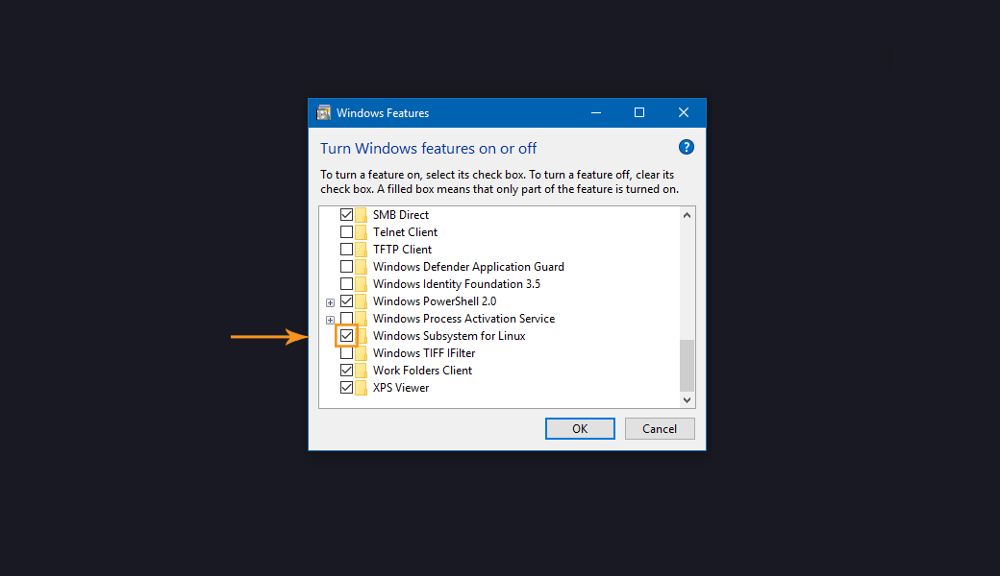
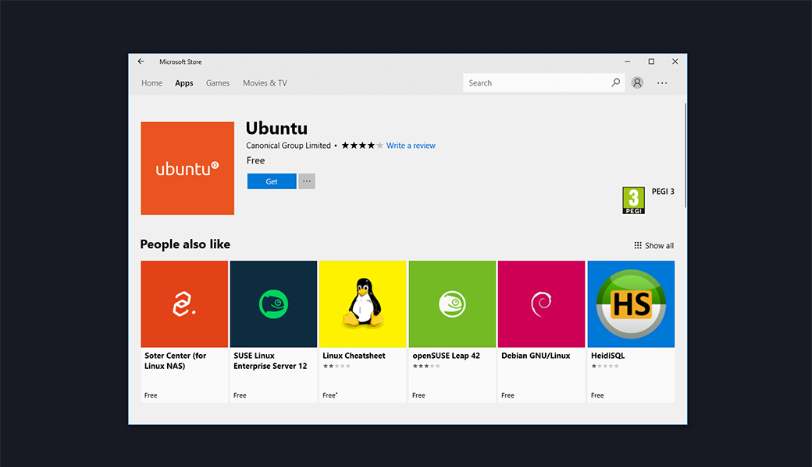
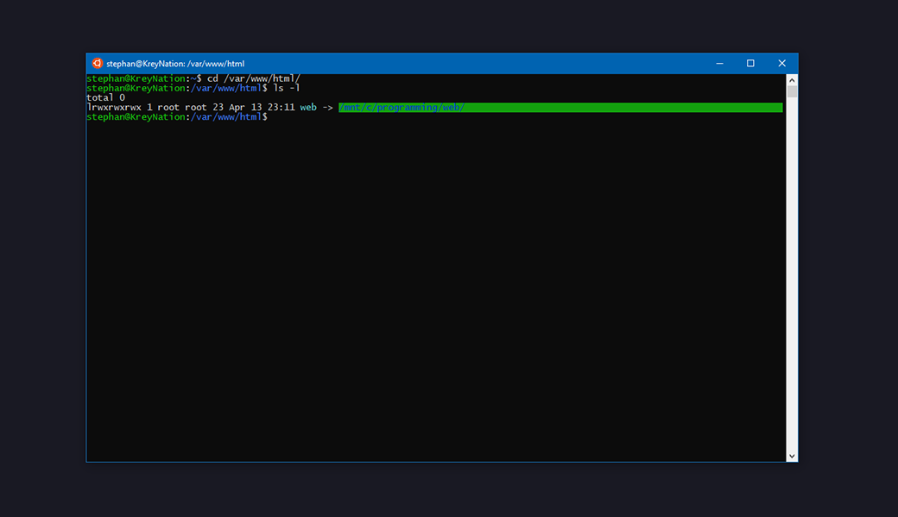
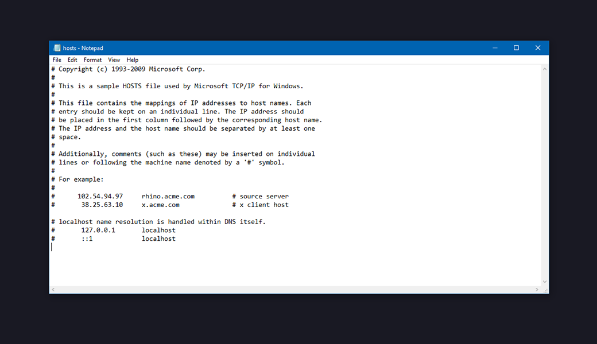

<br>
<br>
For the past year our agency has been working mostly with the [Grav CMS](https://getgrav.org) for smaller to mid sized web projects. Grav offers a flat-file CMS that is lightning fast and requires no database setups with additional security risks to it.

Many of our websites including our own [website](https://www.scopeweb.com) and client websites such as the [Bayron Home Improvement Inc](https://bayroninc.com) website and the [Gemini Gas Springs Inc.](https://www.geminigassprings.com) website. Over the year we have worked out a way to maintain, upgrade and update these websites whenever necessary and adopted an approach that allows any developer to perform maintenance, changes or upgrades.

The switch from XAMPP to WSL seemed daunting at first glance, especially considering XAMPP pretty much offers a one-click-installer, however over time we started developing the need for a more integrated environment. to replicate our server environments. Our PHP servers run off Ubuntu and the decision was made to switch to WSL.

Out of the box WSL doesn't have any of the packages installed that Grav needs to run. You can opt in for either Nginx or Apache2 and on the [Grav website](https://learn.getgrav.org/webservers-hosting/servers/nginx) you can read more about Nginx. In this post I'm going to use Apache2 as our web servers use Apache2.

 {.img-fluid .mb-5}

Even though many developers seem to prefer Mac or Linux, Microsoft has really surprised the community lately with many of their business choices. Open sourcing tons of stuff such as .NET Core and then integrating Linux in the middle of Windows 10. The promise of having access to all software now instead of tying yourself down to a maintenance intensive Linux based OS is very promising, right?!

## The Setup Process
<br>
Alright enough talk, let's dive into the steps you I took and the information I learnt while setting up my development environment. It was a short process and all our developers are very happy with the results. If you're wondering which version of Windows we are running, all our machines run on Windows 10 Enterprise Build 16299.

### 1. Enabling the Windows Subsystem for Linux
<br>
The first step requires us, if you haven't already, to enable the Windows Subsystem for Linux feature. Simply type Feature in the windows search bar and open **Turn Windows features on or off**. After enabling the feature a restart is necessary and you'll be prompted to do it right away.

 {.img-fluid .mb-5}

Having enabled the feature we can now go into the Microsoft Store App and find the Linux distribution that we will be using in this example, Ubuntu.

 {.img-fluid .mb-5}

After installation you can simply launch the Ubuntu 'app' and you'll be prompted with a few initial questions to set a username and a password. You've automatically got sudo access so there's no need for any additional setup.

Next up we will want to install the requirements that you need to run Grav using Apache2 and PHP7.

## Installing Grav's requirements
<br>
After successfully installing WSL Ubuntu 16.04 the first thing you will want to do is update and upgrade all the installed packages. This will ensure you are running the latest-and-greatest:
```
$ sudo apt update
$ sudo apt upgrade
```

Just answer `Y` if prompted.

Before we go any further, let's install Apache2:
```
$ sudo apt-get install apache2
```

Next you will want to install some essential packages:
```
$ sudo apt-get install zip unzip git php7.0-fpm php7.0-cli php7.0-gd php7.0-curl php7.0-mbstring php7.0-xml php7.0-zip php-apcu libapache2-mod-php
```

This will install git, the Apache 2 PHP module and **PHP 7.0**.

## Wrapping up the Apache2 configuration
<br>
Now that we've installed all dependencies we can start setting up Apache2 to work with files placed on your Windows 10 **C:\** drive.

The first thing we will want to do is make sure we create a folder on our local disk. In our situation we create a folder on the **C:\** drive in which we place all our programming projects, called.. **programming**. In the **programming** folder we create a variety of folders to also place nodejs and django projects within the same main folder. What we do next is we create a folder called **web** which will house all our Grav & PHP based projects.

### Creating the symlink
<br>
Next up we need to create a symlink to make sure our WSL setup is linked to our **C:/programming/web** folder and link it to **/var/www/html/** which is easily done with a single command:
```
$ sudo ln -s /mnt/c/programming/web/ /var/www/html/ 
```
You can ofcourse change this to whatever folder you use on your **C:/** drive. For the sake of keeping it simple I am not going to change Apache's default location and we will leave it at **/var/www/html/**.

Hoorah! 🎉we've linked our Apache root folder to our projects folder. We can verify this by moving into our WSL Apache directory and running the `ls -l` command to output the results.

 {.img-fluid .mb-5}

## Setting up local host files
<br>
This may sound very intimidating but it's actually very easy. In this example I will use the scopeweb website to demonstrate how you setup local domains to work with the symlinked Apache system we just setup.

First, you'll want to open Notepad as **Administrator**. Next we click Ctrl + O (open) and go into **C:\Windows\System32\drivers\etc** and open the **hosts** file.

Your default host file should look something like this:

 {.img-fluid .mb-5}

On the bottom we now add a line that points to an Apache2 config file we will create in the next step:
```
127.0.0.1           scopeweb-en.local
```

You can name this whatever you want, but as our website is available in two different languages and I don't want to use any TLD to avoid confusion, we picked **scopeweb-en.local** for our naming scheme.

## Creating the Apache2 conf file
<br>
Now that we've got all the Windows side of things setup, let's start wrapping this up. Clone a project into your **C:\programming\web\** folder and name it whatever you name it in the host file without the .local trailing it i.e. in our situation we called this folder scopeweb-en.

After cloning our website onto our local drive we move into the WSL and change go into the **sites-available** directory of apache and run the following commands to copy the default config file and make our new confing file:
```
$ cd /etc/apache2/sites-available/
$ sudo cp 000-default.conf scopeweb-en.local.conf
$ sudo nano scopeweb-en.local.conf
```

Now you'll want to make some changes in the Apache2 conf file to make sure it points to the right directory and **ServerName**. Take the following steps and check out the example down below:

1. Update the ServerName to whatever you defined in your **C:\Windows\System32\drives\etc\hosts** file - in our situation scopeweb-en.local
2. Update the DocumentRoot to point to the symlinked folder we cloned our project into: `/var/www/html/web/xxxx` whereas xxxx represents your folder name i.e. **scopeweb-en**
3. Save the file - if you use nano like we do in the example `Ctrl + X` to save.

```
<VirtualHost *:80>

        ServerName scopeweb-en.local

        ServerAdmin webmaster@localhost
        DocumentRoot /var/www/html/web/scopeweb-en

        ErrorLog ${APACHE_LOG_DIR}/error.log
        CustomLog ${APACHE_LOG_DIR}/access.log combined

</VirtualHost>

# vim: syntax=apache ts=4 sw=4 sts=4 sr noet
```

### Enabling and finalizing the config
<br>
Next up we need to run a command which enables the new .conf file we created within `/etc/apache2/sites-available/`:
```
$ sudo a2ensite scopeweb-en.local.conf
```

Naturally speaking, change the **scopeweb-en.local.conf** to whatever you named your apache2 config file. After doing this you'll be prompted to reload the Apache2 server and we'll do so to enable the new config `sudo apache2 service reload`.

**Hold your horses!** - there is one more thing we need to do to make sure **Grav** works.

We will add a configuration to our `/etc/apache2/apache2.conf` file:
```
$ sudo nano apache2.conf
```

Scrolling down we'll see a bunch of <Directory/> configuration files predefined and this is where we add a new one, per website we add locally.
```
<Directory /var/www/html/web/scopeweb-en/>
        Options Indexes FollowSymLinks
        AllowOverride All
        Require all granted
</Directory>
```

That's all there is to it. Save the file and restart apache2 `sudo service apache2 restart`.

Navigate to `http://scopeweb-en.local` and we will find our website running on our local machine.

**Happy coding now!**

Have any questions? Shoot me a message on Twitter or leave a comment down below!