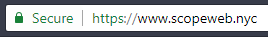

# Google Chrome SSL changes - don't worry!

In recent months, almost every company has dived into privacy rules. Thanks to the arrival of the GDPR, most of us have become more security aware than ever before. On an increasing number of websites, we get welcomed with cookie reports and of course a green lock in the address bar indicating they have a valid SSL certificate (https). But, the green lock will soon disappear.

 {.img-fluid .mb-5}

## What is the green lock?

At the top left of the Chrome browser URL bar you often see a green padlock with the word “Secure” next to it. This green icon clearly indicates that a website is secure and that it uses an SSL connection with HTTPS. The traffic to and from this website is encrypted, making it more difficult to spy on.

 {.img-fluid .img-center .mb-5 .mt-5}

## From green to gray padlock  

In September the color green will be replaced by gray, Google has recently announced. The company makes this choice because they believe that users can assume that internet pages are safe by default (and therefore have HTTPS). So when you ask yourself where your green padlock has gone and what’s wrong with your website, there’s likely nothing wrong.

## From Gray to Red padlock

But how does a Chrome user recognize websites that are still not secure and do not use HTTPS with a valid SSL certificate? Starting since July 2018, these websites will be marked with "Insecure" or "Not safe". Starting in October, there will even be a red padlock in Chrome. This red icon is only shown when a user enters data on an unsafe website. Consider, for example, address details in a contact form. Google chooses to expressly indicate that the entered data may be intercepted.

## What should I do?

If your website does not yet have a valid SSL certificate with HTTPS connection, it is definitely time to take action. Users will see more clearly that your website is not protected clearly and because to be GDPR compliant are you also obliged to provide this secure connection, provided that you process personal data.

Does your website already have an HTTPS connection? You’re doing the right thing! Just be aware of this change, but you won’t have to make any changes.

_Thanks for reading! Feel free to share this article with any of your friends, relatives or colleagues if you found this piece helpful._

_You can connect with me on Twitter: [https://twitter.com/stmoerman](https://twitter.com/stmoerman)_