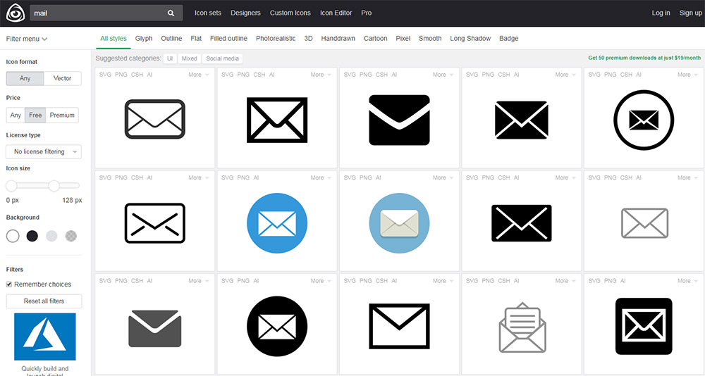
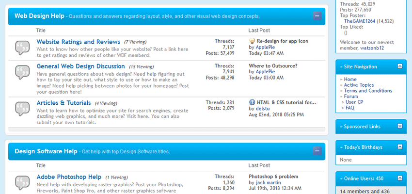
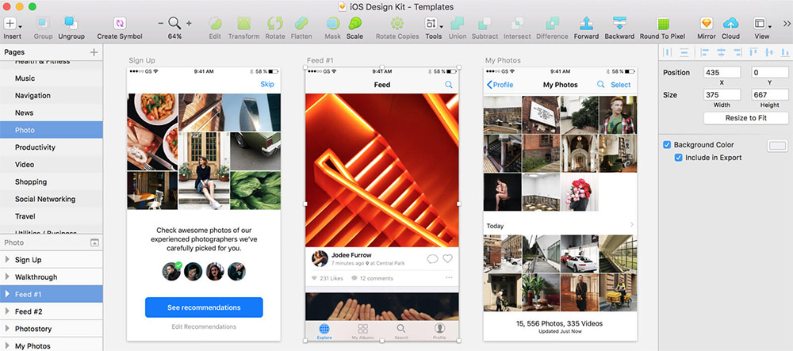
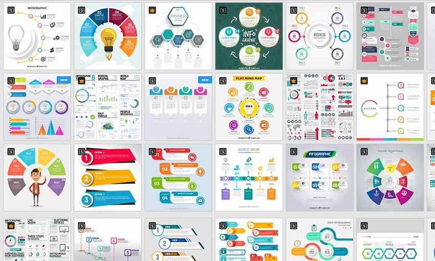
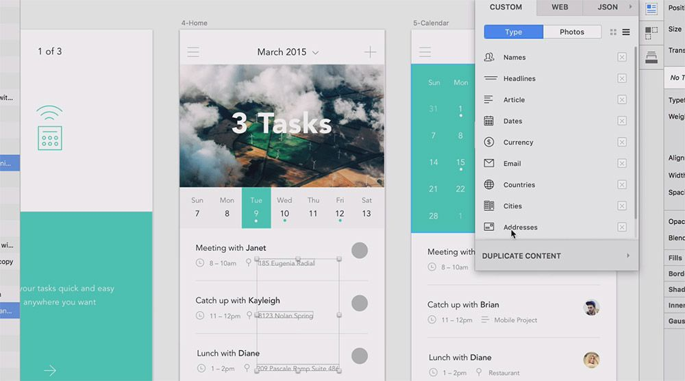

# Free resources & useful tools for web development and web design projects

It doesn’t take much work to find free online resources. While they’re often useful, they are not always of the highest quality. That’s where I spend some of my time researching to help you get started quickly.

Below I’ve curated a nice list for anyone who is interested in some great web development resources.

<h2><a href="https://www.iconfinder.com/" target="_blank" rel="noopener">Iconfinder</a></h2>

 {.img-fluid .img-center .mb-5 .mt-5}

If you spend any time searching for icons, then you’re bound to stumble upon <a href="https://www.iconfinder.com/" target="_blank" rel="noopener">Iconfinder</a>. This is the premier destination for any icon you could ever need.

It operates like a search engine, where you type in an icon style or glyph (like “magnifying glass” for a search icon). You’ll then see results with a mix of commercial and free options.

But if you look deeper into the search settings, you can filter the results to view just free or just paid options. You can also set the icon sizes and a few other search criteria.

No doubt that Iconfinder is the best place to start if you’re looking for free icons. If the icon is out there online, Iconfinder has it indexed.

<h2><a href="http://www.webdesignforums.net/forum/forum.php" target="_blank" rel="noopener">Web Design Forums</a></h2>

 {.img-fluid .img-center .mb-5 .mt-5}

If you want a very popular community that can answer questions and discussions promptly, the high-traffic Web Design Forums is for you. The community is long-running with nearly 60,000 members and 300,000 posts. The forum is split into sub-sections, so you can discuss design, get development help for any web programming language, or participate in a contest!

<h2><a href="https://iosdesignkit.io/" target="_blank" rel="noopener">iOS Design Kit</a></h2>

 {.img-fluid .img-center .mb-5 .mt-5}

Every new release of iOS prompts an updated GUI kit and this freebie is by far the most comprehensive one to date.

It covers all the major elements for iPhone and iPad apps with free kits for most design software. You’ll find PSDs for Photoshop too, but you can download just the Sketch files with the same iOS-styled vector elements.

These elements all come in @1x size, but since they’re vectors you can easily resize them without any quality loss.

<h2><a href="https://www.freepik.com/" target="_blank" rel="noopener">Freepik</a></h2>

 {.img-fluid .img-center .mb-5 .mt-5}

This freemium website has plenty of free infographics available for download. Created by both the website and its community, the templates are mostly vectors. Adobe Illustrator users will enjoy using Freepik. You’re limited to five downloads a day as a free user, and you must credit the author and Freepik. If you’re looking for variety, this is the place to find it.

<h2><a href="https://buddycss.com/" target="_blank" rel="noopener">BuddyCSS</a></h2>

 {.img-fluid .img-center .mb-5 .mt-5}

BuddyCSS - A new, simple CSS framework to build awesome websites easily. Comparable to Bootstrap, fully focussed on Flex &amp; Grid. Really useful for rapid prototyping and get a better understanding of Flexbox and CSS grid.

<h2><a href="https://www.invisionapp.com/craft" target="_blank" rel="noopener">InVision Craft</a></h2>

 {.img-fluid .img-center .mb-5 .mt-5}

Starting off the list is InVision Craft which is by far the biggest plugin around. It’s available for Photoshop and Sketch, both of which offer the same features.

Craft is more like a library of plugins with many different features mixed in together. You can design prototypes, automate dummy content, and automatically sync design resources to the cloud. All from the Craft plugin panel.

This plugin is free and will remain free forever. I thoroughly recommend trying this out and see how it improves your digital workflow.

<h2><a href="https://codepen.io/CreativeJuiz/pen/zqKtp" target="_blank" rel="noopener">Flat UI Input File</a></h2>

<iframe id="cp_embed_HbwcG" src="//codepen.io/CreativeJuiz/embed/preview/HbwcG?height=450&amp;theme-id=0&amp;slug-hash=HbwcG&amp;default-tab=css%2Cresult&amp;user=CreativeJuiz&amp;embed-version=2&amp;pen-title=Custom%20styles%20for%20Input%20file&amp;preview=true" scrolling="no" allowtransparency="true" allowfullscreen="true" allowpaymentrequest="true" name="CodePen Embed" title="Custom styles for Input file" class="cp_embed_iframe " style="width: 100%; overflow: hidden;" height="450" frameborder="0"></iframe>

Here’s a slightly different <a href="https://codepen.io/CreativeJuiz/pen/HbwcG" target="_blank" rel="noopener">flat upload field</a> created by Geoffrey Crofte. This one also relies on some JavaScript, but styles the entire input with CSS3 properties.

Since this is a sample snippet, you can’t actually upload files anywhere. But, that’s easy enough to change if you move this into your own site. The core design and setup is really what gives this snippet some life.

The return function runs in JavaScript, so that’s where you’d handle the file uploads, on-screen changes or anything else.

Best of all, these codes work in browsers dating back to IE 8! So it’s a pretty solid option if you’re concerned about accessibility.

_Thanks for reading! Feel free to share this article with any of your friends, relatives or colleagues if you found this piece helpful._

_You can connect with me on Twitter: [https://twitter.com/stmoerman](https://twitter.com/stmoerman)_